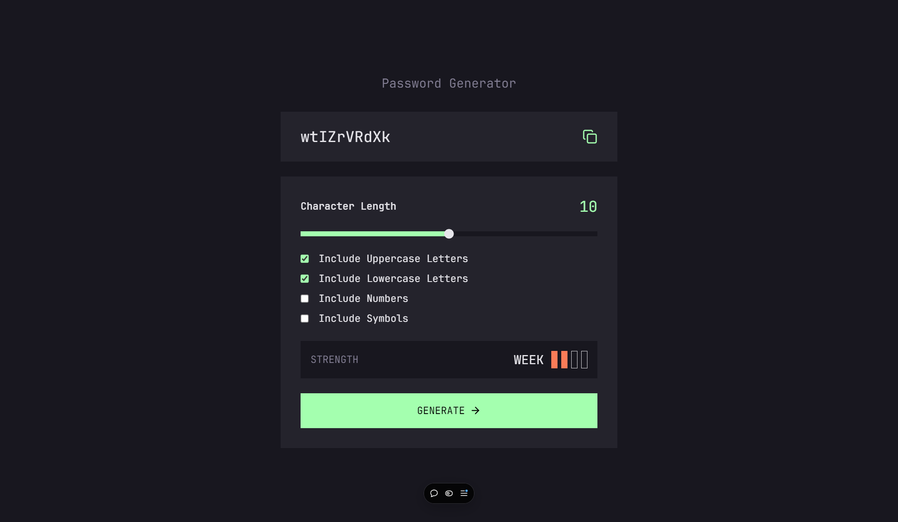

# Password Generator

This is a simple password generator application built with React, Tailwind CSS, Zustand for state management, and TypeScript.

## Demo

- [View Live Demo](https://cda-react-password-generator-app.vercel.app/)

## Features

-   Generate strong, random passwords
-   Options to include uppercase, lowercase, numbers, and special characters
-   Copy the generated password to the clipboard

## Screenshots

## Usage

1. Select the desired options for the password:
    - Include uppercase letters
    - Include lowercase letters
    - Include numbers
    - Include special characters
2. Click the "Generate Password" button to create a new password.
3. Click the "Copy to Clipboard" button to copy the generated password.

## Technologies Used

-   [React](https://reactjs.org/)
-   [Tailwind CSS](https://tailwindcss.com/)
-   [Zustand](https://github.com/pmndrs/zustand)
-   [TypeScript](https://www.typescriptlang.org/)
